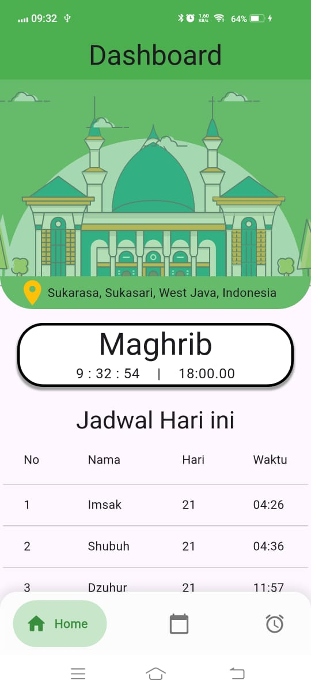
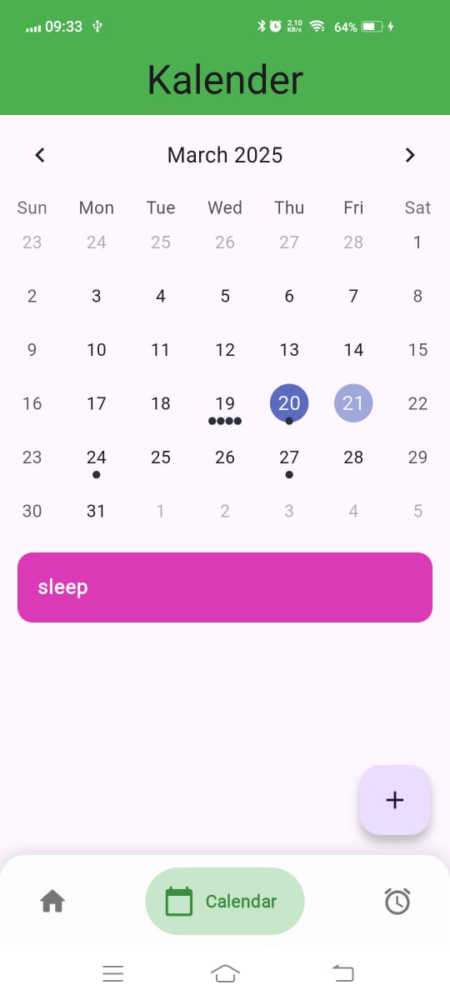
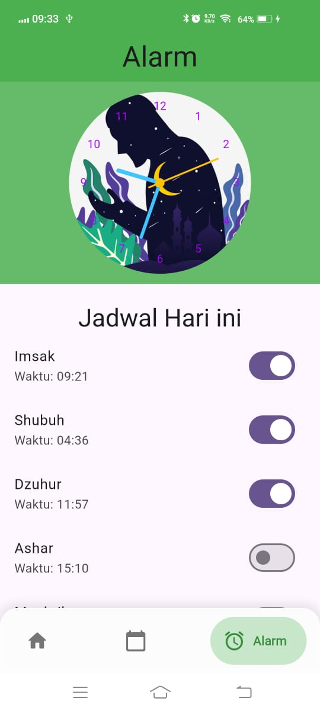

# 📌 Muslim Schedule

**Muslim Schedule** adalah aplikasi yang membantu umat Muslim dalam menjalankan ibadah dengan lebih terorganisir. Aplikasi ini menyediakan fitur waktu sholat dan puasa, kalender untuk mencatat acara penting, serta alarm sebagai pengingat ibadah.

---

## 📱 Fitur Utama

### 🏠 Home
- Menampilkan waktu sholat berdasarkan lokasi pengguna.
- UI sederhana dan informatif.

### 📅 Kalender
- Membuat dan mengelola event islami.
- Tampilan kalender yang interaktif.

### ⏰ Alarm
- Notifikasi waktu sholat.
- Pengingat untuk sahur dan berbuka puasa.

---

## 🖼️ Mockup
Berikut adalah tampilan dari aplikasi **Muslim Schedule**:

1️⃣ **Halaman Home**

2️⃣ **Halaman Kalender**

3️⃣ **Halaman Alarm**

---

## 🎥 Demo Video
Lihat video demo aplikasi **Muslim Schedule** di sini:  

---

## 📩 Kontak
Jika ada pertanyaan atau masukan, silakan hubungi kami di **wildan27370@gmail.com**.

---

⭐ **Jangan lupa beri bintang repo ini jika bermanfaat!** ⭐
